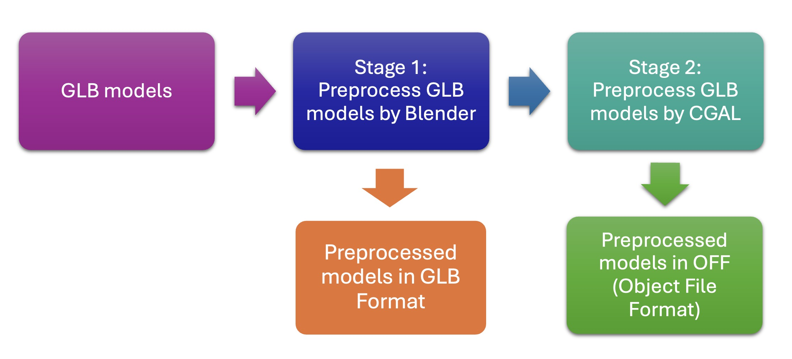

# hra-glb-preprocessor

**Version:** 1.0.0

**Release date:** 15 June 2024

## Overview:
hra-glb-preprocessor project includes:
1. Preprocess (fix non-manifold meshes and filling holes) 3D models using both Blender Python API (Stage 1) and CGAL (Stage 2). There are two options: preprocess one single GLB file or preprocess all the GLB files in one directory;
2. Generate OFF files for all the GLB files in one directory if needed. 


## Installation Instructions
For Stage 1:

1. Install Blender (**Please install Blender 4.1 or lower**)
    - Ubuntu:
        1. Please follow instructions at https://docs.blender.org/manual/en/latest/getting_started/installing/linux.html.
        2. Add blender to path: https://docs.blender.org/manual/en/latest/advanced/command_line/launch/linux.html
    - MacOS:
        1. Please follow instructions at https://docs.blender.org/manual/en/latest/getting_started/installing/macos.html 
        2. Add blender to path: https://docs.blender.org/manual/en/latest/advanced/command_line/launch/macos.html
    - Windows:
        1. Please follow instructions at https://docs.blender.org/manual/en/latest/getting_started/installing/windows.html
        2. Add blender to path:
           1. Find the directory where Blender is installed, e.g., [C:\Program Files\Blender Foundation\Blender\blender.exe]()
           2. Add both [C:\Program Files\Blender Foundation\Blender\blender.exe](), [C:\Program Files\Blender Foundation\Blender]() (Please replace the two paths using your blender installation path) to environment variable. Please see https://www.computerhope.com/issues/ch000549.htm if you are not sure how to add environment variables on Windows.
           3. Restart the cmd or powershell.
           4. Test by entering "blender" in cmd. If Blender is started automatically, the environment variables are successfully added.
    

2. Install Pandas in Blender Python
    - Linux & MacOS & Windows
        ```bash
        blender --background --python install_package.py
        ```

For Stage 2, install C++ libraries and dependencies as well as Python packages:

3. CMake
    ```bash
    sudo apt-get install build-essential libssl-dev
    cd /tmp
    wget https://github.com/Kitware/CMake/releases/download/v3.20.0/cmake-3.20.0.tar.gz
    tar -zxvf cmake-3.20.0.tar.gz
    cd cmake-3.20.0
    ./bootstrap
    make
    sudo make install
    ```
4. Boost
    ```bash
    sudo apt-get update
    sudo apt-get install libboost-all-dev
    ```
5. GMP
    ```bash
    sudo apt-get install libgmp-dev
    ```
6. MPFR
    ```bash
    sudo apt-get install libmpfr-dev
    ```
7. CGAL
    ```bash
    sudo apt-get install libcgal-dev
    ```
8. Eigen3
    ```bash
    sudo apt install libeigen3-dev
    ```
9. cpprestsdk
    ```bash
    sudo apt-get install libcpprest-dev
    ```
10. pygltflib
    ```bash
    pip install pygltflib
    ```

## Compilation
1. Change directory to mesh_processing_cgal
    
    ```bash
    cd mesh_processing_cgal
    ```

2. Compile the code using CMake:
    ```bash
    mkdir build
    cd build
    cmake ..
    make
    ```

## Usage 

Stage 1: 
1. Change directory to mesh_processing_blender
   ```bash
   cd mesh_processing_blender
   ```
   
2. To pre-process a single model, run glb_preprocessor.py by specifying input_glb_path and output_glb_path  
    ```bash
    python3 glb_preprocessor.py input_glb_path output_glb_path
    ```
    e.g., 
    ```bash
    python3 glb_preprocessor.py ../model/3d-vh-f-blood-vasculature.glb ../output/3d-vh-f-blood-vasculature.glb
    ```
3. Download and pre-process all organ models and generate OFF models in Stage 1. 
    ```bash
    python3 glb_preprocessor_all_organs.py --url url --downloaded_dir downloaded_dir --output_glb_model_dir preprocessed_glb_model_dir
    ```
    There are three arguments:

    - **url** is the endpoint to download all the latest reference organ models; the default value is https://apps.humanatlas.io/api/v1/reference-organs.
    - **downloaded_dir** is the directory to cache all the models; the default value is downloaded_organs/.
    - **output_glb_model_dir** is the output diretory to store all the preprocessed GLB models; the default value is ../all_preprocessed_glb_models/.
    
    e.g., 
    ```bash
    python3 glb_preprocessor_all_organs.py --url https://apps.humanatlas.io/api/v1/reference-organs --downloaded_dir downloaded_folder/ --output_glb_model_dir all_preprocessed_glb_models/ --output_off_model_dir all_preprocessed_off_models/
    ```

Stage 2: 

4. Change directory to mesh_processing_cgal
   ```bash
   cd mesh_processing_cgal
   ```
5. Process the preprocessed models from Stage 1 using CGAL and generate OFF models
    ```bash
    python3 all_organ_preprocessor_cgal.py --preproceesed_models_stage_1 dir_models_stage_1 --output_off_model_dir output_off_model_dir
    ```
    There are two arguments:
    - **preprocessed_models_stage_1** is the diretory of all the preprocessed GLB models from Stage 1; the default value is ../all_preprocessed_glb_models/.
    - **output_off_model_dir** is the output directory to store all the preprocessed OFF models, which are generated based on the GLB models; the default value is all_preprocessed_off_models_cgal/.

